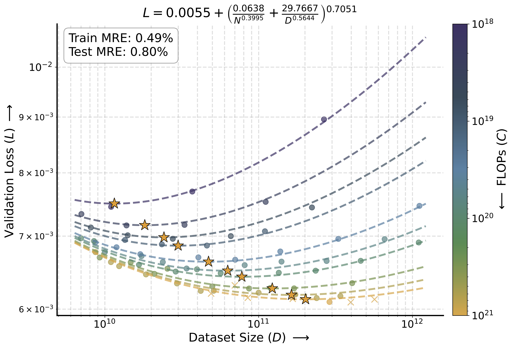
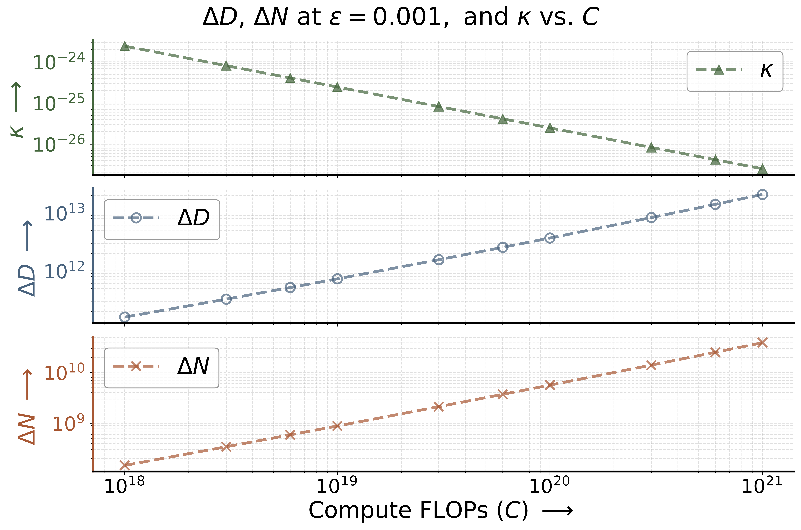

# Scaling Properties of Continuous Diffusion Spoken Language Models

This repository accompanies the research paper **[Scaling Properties of Continuous Diffusion Spoken Language Models](https://arxiv.org/pdf/2604.24416)** by *Jason Ramapuram, Eeshan Gunesh Dhekane, Amitis Shidani, Dan Busbridge, Bogdan Mazoure, Zijin Gu, Russ Webb, Tatiana Likhomanenko, and Navdeep Jaitly* on scaling laws of continuous diffusion spoken language models.

## Abstract

 Speech-only spoken language models (SLMs) lag behind text and text-speech models in performance, with recent discrete autoregressive (AR) SLMs indicating significant computational and data demands to match text models. 
 Since discretizing continuous speech for AR creates bottlenecks, we explore whether continuous diffusion (CD) SLM is more viable. To quantify the linguistic quality of SLMs, we introduce the phoneme Jensen-Shannon divergence (pJSD) metric. 
 Our analysis reveals CD SLMs, mirroring AR behavior, exhibit scaling laws for validation loss and pJSD, and show optimal token-to-parameter ratios decreasing as compute scales. 
 However, for the latter, loss becomes insensitive to choice of data and model sizes, showing potential for fast inference. 
 Scaling CD SLMs to 16B parameters with tens of millions of hours of conversational data enables generation of emotive, prosodic, multi-speaker, multilingual speech, though achieving long-form coherence remains a significant challenge. 

<p align="center">
  <!-- Left Image -->
  <a href="./assets/isoflop.png" style="display: inline-block; margin-right: 15px; vertical-align: middle;">
    
  </a>
  <!-- Right Image -->
  <a href="./assets/curvature.png" style="display: inline-block; vertical-align: middle;">
    
  </a>
  <!-- Shared Caption -->
  <br>
</p>

**Left:** Scaling law fit for validation loss. Training ($\bullet$) and testing ($\times$) points are shown alongside compute-optimal points ($\star$). **Right:** The curvature $\kappa$ of isoFLOPs at their optima decreases as compute increases: flattening corresponds to approximately 2 orders of magnitude expansion in the range of model ($\Delta N$) and dataset ($\Delta D$) sizes yielding a loss within $\epsilon$ of the optimum $L^{\ast}$. Thus, higher computes allow near-optimal performance across a much wider variety of parameter-to-data allocations, opening up an efficient inference frontier.

## Results

- *(Known trend)* Validation loss follows Chinchilla-style scaling laws.
- *(Known trend)* The optimal token-to-parameter ratio is compute-dependent, decreasing as the compute budget scales.
- *(New trend)* Higher computes allow near-optimal performance across a much wider variety of parameter-to-data allocations, opening up possibility for fast inference.
- *(Known trend)* The pJSD metric demonstrates that learned "languageness" follows scaling laws, mirroring discrete AR models (sBLIMP, sStoryCloze). Thus, pJSD provides a viable sampling-based evaluation tool for generative models that do not offer the easily factorized likelihoods of autoregressive architectures.
- *(New trend)* Unlike prior work on AR SLMs, we also analyze standard perceptual quality metrics. We find they **do not** exhibit scaling laws (this behavior is aligned with their poor correlation to human mean opinion scores). However, two out of four Meta Audiobox Aesthetics components (content enjoyment and content understanding) **do** scale predictably.
- *(New trend)* Metrics without scaling laws generally saturate near their real-data baselines. In contrast, for certain metrics, our best scaling fits suggest that real-data baselines remain unreachable at any compute budget.

Finally, we scale CD SLMs to a 16B parameter model trained on tens of millions of hours of conversational speech.
While at that scale our model generates multi-speaker multilingual conversations with rich emotions and prosody, achieving long-form linguistic coherence remains a significant challenge.
**This shortfall suggests that given current compute budgets and available speech data, further scaling of SLMs is impractical unless a new speech representation or modeling paradigm emerge, or we pivot to text-speech models.** Note, that we focus exclusively on pretraining, where foundational representations emerge; while post-training is highly effective for steering and refining behavior, there is no evidence it can instill basic linguistic coherence if the base model lacks it.

## License

- Repository is released under [LICENSE](LICENSE). 
- All generated speech samples are licensed under [Creative Commons Attribution-Noncommercial-Nonderivatives 4.0 International License](https://creativecommons.org/licenses/by-nc-nd/4.0/) [LICENSE_DATA](LICENSE_DATA).

## Citations

```
@article{ramapuram2026scaling,
  title={Scaling Properties of Continuous Diffusion Spoken Language Models},
  author={Ramapuram, Jason and Dhekane, Eeshan Gunesh and Shidani, Amitis and Busbridge, Dan and Mazoure, Bogdan and Gu, Zijin and Webb, Russ and Likhomanenko, Tatiana and Jaitly, Navdeep},
  journal={Interspeech},
  year={2026}
}
```
